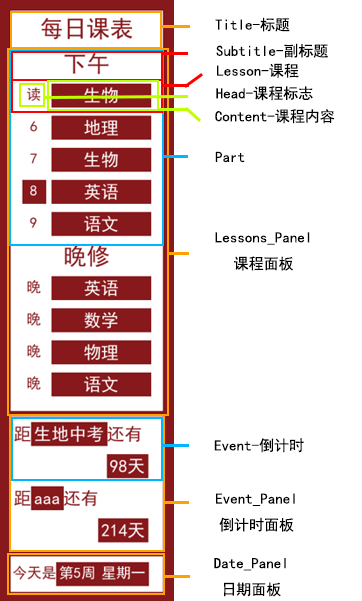

# Lesson Table - 课程表
一个每天自动更新的课程表

## 使用帮助
### 配置文件
在`config.json`文件中：
- term_beginning：开学周星期日零点的时间戳(用于计算单双周等)

例如 以下为2024-02-19开学的时间戳
```json
"term_beginning": 1708272000
```

- width：课表最大宽度(px)
- color：课表颜色(rgb)
- title：课表标题
- font：课表字体(字体文件需放置在程序目录下)
- lang：语言json
```json
"lang": {
        // 这些为课程或课程标志 用一个或两个字符代替方便后期编写课表
        "C": "语文", 
        ...

        // 一周中每一天的中文
        "Mon.": "星期一",
        ...

        // part 用于后面编写课表
        "morning": "上午",
        ...

        // 显示日期所用的格式化字符串
        // %s表示数据 []表示高亮
        "show_date": "今天是[第%s周][%s]",

        // 显示倒计时所用的格式化字符串
        "show_event_1": "距[%s]还有",
        "show_event_2": "[%s天]"

    }
```
- parts_in_order：按时间顺序排列的[Part](#part)
```json
"parts_in_order": [
        // 这里的每个值都要和lang的键所对应
        // 课表中显示part的顺序和这里所保存的part顺序一致
        "morning", // 示例文件中lang的R即表示"上午"
        "afternoon",
        "evening"
    ],
```
- lesson_table：课程表
```json
// 在lesson_table中出现的时间都是:时间戳-当天零点的时间戳
// 也就是从0点开始的第n秒
"lesson_table": [
        { // 周一
            "morning": [
                // 为了防止课表过长看不清 每个part都会有一个固定的显示时间
                // 例如MorningPart为0点到12点 AfternoonPart为13点到22点
                [0,44000], // 显示时间(示例为0点到12点多)
                [ // 第一节课
                    25200, // 起始时间
                    28200, // 结束时间
                    "R", // 课程标志(示例文件中lang的R即表示"读")
                    "C"  // 课程内容(示例文件中lang的R即表示"语文")
                ],
                [28800,31200,"1","C"], //第二节课
                ...
            ]
        },
        {...}, // 周二
        {...}, // 周三
        {...}, // 周四
        {...}, // 周五
        {...}, // 周六
        {...}  // 周日
    ]
```
- event：倒计时
```json
"event": {
        "生地中考": [
            1719676800, // 时间戳
            true, // 是否忽略节假日
            true // 是否忽略周末
            ],
        ...
    }
```
- temporary_transfer_of_lesson：临时调课
```json
"temporary_transfer_of_lesson":[
        [
            1711296000, // 调课当天零点时间戳
            "morning", // 调课的part
            0, // 调该part中第几节课
            "DK", // 课程标志
            "E" // 课程内容
        ],
        ...
    ]
```

### 更多
你可以通过更改`background.png`和`font.ttf`来改变背景和字体


## 程序原理
1. 使用`datetime`库实现了各种关于日期的功能并通过读取`lessons.json`中的课程信息获取当天课表
2. 如果**当前课表信息**和**上次运行程序时的课表信息**(last文件)一致则直接退出程序(无须更新课表)
2. 使用`PIL`库绘制了一个课表
3. 使用`PIL`库将绘制出来的课表覆盖在`background.png`上并生成`tmp.png`文件
4. 使用`ctypes`库中提供的相关接口将`tmp.png`设为壁纸

## 关于代码里的一些概念
先看一遍有助于理解~~我写的shit山~~代码



### Title
标题

整个课程表有且仅有一个

### Lesson_Panel
课程面板

包含多个[Part](#Part)

### Part
用于表示一天中的某个时间段

一个[课程面板](#Lesson_Panel)中可以存在多个part
一个part且仅有一个[副标题](#Subtitle)
一个part中存在多个[课程](#Lesson)

### Subtitle
副标题

### Lesson
一节课程

包含一个[课程标志](#Head)和一个[课程内容](#Content)

### Head
课程标志

一般用于表示第x节课

### Content
课程内容

### Event_Panel
倒计时面板

包含多个[倒计时](#Event)

### Event
倒计时

### Date_Panel
日期面板

## 更新日志
24/3/30
- 修改README文件

24/3/24
- 优化代码
- 修复bug
- 新增调课功能

24/3/23/第二次更新
- 优化代码
- 修复bug
- 新增忽略节假日/周末功能

24/3/23/第一次更新
- V1.0版本